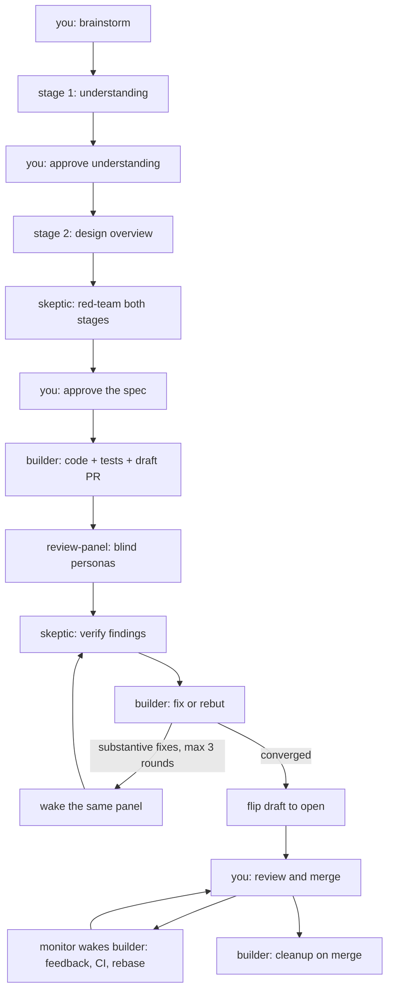

# Architecture

This harness runs the software delivery pipeline as a simple chain — brainstorm, implement, review loop, human review, merge and clean — with the human kept at the decision points where judgment is irreplaceable. You explain intent, approve the design, decide escalations, and merge. Everything in between is done by three agents and a handful of skills, with no stored state of any kind: GitHub and the agents' own context are the only memory.

## Pipeline



## Workflow

### 1. Understand (`brainstorming`)

Two gated stages turn a raw request into an approved spec. Stage 1 (Understanding) captures the reasoning chain — the task, who it is for, what the output enables, the request, observable acceptance criteria. Stage 2 (Design Overview) produces genuinely different architectures ranked only by outcome quality, green-field always present, effort never a criterion. The skeptic red-teams both stages before you see the result, and each stage ends with your explicit approval. The spec lives in the conversation; it is published only if you ask, and only to GitHub (a tracking issue). Nothing is written to disk — repositories hold only architectural docs and ADRs.

### 2. Build (`implement`)

The single manual entry point of an otherwise automatic chain. The main agent is an orchestrator that never touches code: it creates a worktree and branch, spawns one persistent builder agent with the spec, and coordinates everything after by waking agents. The builder writes all code and tests, opens a draft PR (via `push-pr`), and remains that PR's only implementer for its entire life. It escalates rather than silently deviating from the approved design.

### 3. Review (`review-panel`)

The panel is spawned once per PR: the orchestrator selects personas by judging the impact of the change (fresh-eyes always runs; heavier changes get more lenses), then spawns one generic `reviewer` agent per selected persona, blind and parallel, each reading its own persona file; the `correct-design` persona is also told where the spec lives. Findings are deduped, then verified by the `skeptic` (provenance and severity stripped; refute-by-default); survivors post as one batched inline review per round, each finding marked fix-now or deferred to a follow-up PR so PRs stay small. The builder then fixes or rebuts on the threads. For re-checks the same reviewers are woken — their context survives, so no bookkeeping is needed. Reaching three rounds without convergence stops the loop and escalates to you with a diagnosis; otherwise the PR flips open and you get one of exactly two messages: "ready for your final review - push back or merge" or "escalated items - findings pushed back with uncertainty, your call".

`/review-panel` also runs standalone on any PR, including ones the harness did not build.

### 4. Human review and watch

After the flip, humans own the PR. The main session arms one persistent monitor (`github-comment`, Mode 5) that polls comments, submitted reviews, review threads, CI, pushes, and merge state. On any event its only action is waking the builder with "PR updated" — the builder inspects the PR and does the rest: responds to your feedback and implements it, fixes CI, rebases when the base moves, and on merge files one tracking issue per deferred finding before deleting its worktree and branch. If the session dies, you resume it; GitHub holds the full state and the builder keeps its context.

## Agents

| Agent | Role |
|---|---|
| `builder` | One per PR, persistent for its whole life: implements from the spec, opens the draft PR, fixes or rebuts review findings, owns every push until its checks are green, and after the flip handles feedback, rebases, and cleanup on merge. Escalates instead of deviating from the approved design. |
| `reviewer` | One generic definition holding the review discipline, severity scale, precision contract, and the single findings format. Each spawn reads and adopts the persona file it is pointed at. Read-only. |
| `skeptic` | Adversarial verifier: refutes findings with codebase evidence (refute-by-default) and red-teams brainstorm designs. Read-only; pinned to Fable 5 with `effort: xhigh` in its definition. |

Builder and reviewer inherit the session model; the skeptic is pinned to Fable 5, and the push-pr body author runs on sonnet. Agent descriptions state capability only — every subagent can see the roster of named agents, so a description must never leak pipeline structure to blind reviewers.

## Skills

| Skill | Purpose |
|---|---|
| `brainstorming` | Gated Understanding and Design stages, skeptic red-team, approved spec. |
| `implement` | The delivery chain: worktree, builder, draft PR, review loop via `review-panel`, open flip, one message, monitor watch. |
| `review-panel` | The standalone panel: persona roster and selection, blind parallel reviewers spawned once, skeptic verification, one batched review per round, wake-based re-checks. Personas live in `personas/`, one file each. |
| `github-comment` | Agent-facing gh library: batched inline reviews, thread replies and resolution, and the PR monitor plus wake-the-builder pattern. |
| `push-pr` | Creates or updates a PR (draft in the chain) with template-filled or generated body, labels, and a Verification section. |
| `receiving-code-review` | Discipline for handling review feedback: verify before implementing, calibrated push-back, no performative agreement. |
| `build-design-system` | Builds a complete frontend design system from an approved design exploration. |

`skills-disabled/` holds skills that are kept but not active: `visual-evidence` (screenshots and interaction GIFs for frontend PRs) and the Graphite stacking prompt.

## Conventions

- **No stored data.** No profiles, state directories, checkpoints, briefs, lessons, markers, or trailers. Repo facts come from `gh` and the repository at runtime; anything worth remembering across sessions goes to Claude Code's built-in memory.
- **Bot identity.** Every autonomously posted GitHub comment begins with the line `**Harness automated comment**`. Commit messages and PR bodies never mention AI or automation; no emoji anywhere in outward-facing text.
- **PR lifecycle.** Draft while machines iterate; flipped to open the moment a human-facing message fires. Never merged, closed, or approved autonomously.
- **One builder per PR.** All fixes go to the same persistent agent by name; a fresh fixer per round is forbidden.

## Repository layout

```
~/.claude/
├── CLAUDE.md        global rules (decision making, code quality, testing, workflow)
├── settings.json    permissions, hooks, environment
├── rules/           supplementary global rules
├── hooks/           PreToolUse guards (commit attribution)
├── agents/          builder, reviewer, skeptic
├── skills/          the skills table above (review-panel/personas/ holds the persona files)
```

An ignore-all `.gitignore` keeps Claude Code's runtime files (caches, history, telemetry) out of version control; only configuration is whitelisted.
