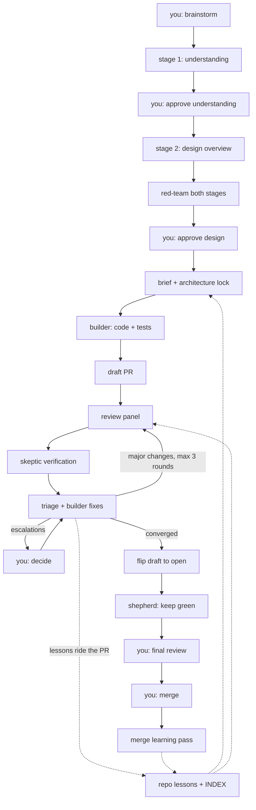

# Architecture

This harness runs the software delivery pipeline as a chain of agents, with the human kept at the decision points where judgment is irreplaceable. You explain intent, approve the understanding and the design, decide escalations, and merge. Everything in between — implementation, tests, pull requests, multi-reviewer code review, fix rounds, CI maintenance, rebases — is done by agents that message you exactly when it is your turn and never before.

The rest of this document walks the whole pipeline: the end-to-end diagram, each workflow stage, the lessons layer that lets the system improve over time, the shared conventions, and the repository layout. Model assignments are not repeated here; the model table in the [README](README.md) is the single source of truth for which model runs what.

## Pipeline



## Workflow

### W1 — UNDERSTAND (`brainstorming`)

Turns a raw request into an approved design checkpoint through two gated stages. Stage 1 (Understanding) captures the reasoning chain — the task, who it is for, what the output enables, the request, and observable acceptance criteria. Stage 2 (Design Overview) produces the recommended architecture: two to three genuinely different options ranked only by outcome quality, with the green-field design always present and effort never a ranking criterion. An adversarial red-team attacks both stages, hunting for blind spots and for human-economics smuggled into the ranking, before you see the result. Each stage ends with your explicit approval, and the approved architecture is recorded in the checkpoint's Decisions section. Nothing proceeds to implementation without your sign-off.

### W2 — BUILD (`implement`)

The single manual entry point of an otherwise automatic chain. The main agent authors an implementation brief that carries the architecture lock — the approved design travels with the work, and the builder must escalate rather than silently deviate from it. One persistent builder agent is spawned per PR: it writes all code and tests, keeps its implementation rationale for the PR's entire life, and is the only agent that ever writes code for that PR, in the initial build and in every later fix round. Work lands as small, single-concern PRs, each with its own tests and a Verification section (exact command plus expected output). PRs are created as drafts via `push-pr` — draft while machines iterate, open only when humans enter.

### W3 — REVIEW (`pr-review` + `review-triage`)

The in-depth review loop runs on the draft PR. `pr-review` spawns a blind, parallel panel of reviewers; findings survive only if skeptic agents fail to refute them, and any finding bound for auto-fix additionally requires an executable reproducer before the fix is written. Verified findings post to the PR as inline resolvable comments plus a sticky summary — a single top-level comment updated in place each round rather than reposted. `review-triage` then classifies every unresolved thread into exactly one bucket, dispatches fixes to the resumed builder, and re-triggers the panel only when major changes were applied (three rounds maximum).

This is the cross-model integrity chain: the builder writes, the panel reviews, the skeptics verify, the builder fixes — every artifact is checked by a model different from the one that produced it, so a hallucination shared inside one model family cannot verify itself. When the loop converges, the PR flips from draft to open (the draft-to-open flip, `gh pr ready`) and you receive one of exactly two message types: (1) "ready for your final review - push back or merge", or (2) "escalated items - findings pushed back with uncertainty, your call", the latter also posted as a top-level bot-headed PR comment. After convergence only humans review; later pushes never re-spawn the panel.

### W4 — KEEP-GREEN (`pr-shepherd`)

A lightweight maintenance routine owns the open PR until merge so nobody has to babysit it, keeping it green — passing CI, rebased on base, description in sync. It rebases behind base (force-push with lease only, on the PR's own branch only), classifies CI failures (flaky gets rerun, legitimate failures go to the resumed builder), autofixes lint, and keeps the PR description in sync with the diff. It pings you using the same two message types and never merges, closes, or spawns reviewers. On merge it cleans up the branch, worktree, and state, then hands the PR's full paper trail — panel comments, triage commits, escalations, your comments — to a learning pass.

### L — LEARN (lessons layer)

Every human intervention becomes a lesson so future rounds need less of you. Lessons ride the PR that taught them: capture events during build and review write lesson files into the working tree, committed alongside the fixes, so learning stays human-gated through your mandatory final review with zero extra PRs. The merge-time learning pass distills anything missed into staging that rides the next PR. Lessons live in the target repository and are scoped by domain and path globs, so future brainstorms, builds, and reviews load only what applies to the work at hand.

## Lessons mechanics

Lessons live in the target repository — not in this one — at `.claude/lessons/<domain>/<slug>.md`, each with YAML frontmatter: `name`, a one-line `summary`, `domains` (list), and `globs` (path patterns). `.claude/lessons/INDEX.md` holds one line per lesson (summary plus domains) and is regenerated whenever a lesson is written; the repo's `CLAUDE.md` imports it via `@.claude/lessons/INDEX.md`, so the index enters context automatically in every session.

Retrieval scales through the index: consumers (the builder, each panel reviewer, brainstorming) read the one-line index and load the full text only of lessons whose domains and globs match the diff or task at hand. Two hundred lessons cost two hundred index lines, not two hundred files in context.

Capture is event-driven: triage records user push-backs and rejected findings (repo-specific ones as repo lessons, generalizable rulings as care-abouts and negative rules appended to the reviewer and persona files), brainstorming records platform decisions, and the shepherd's merge-time pass distills anything missed from the PR's paper trail into staging under `~/.claude/state/lessons/<owner>-<repo>/`, which the next build commits into the repo's lessons. All repository lessons reach the repo through PRs you review.

## Conventions

- **Per-repo profiles.** Skills contain zero repository-specific facts. A repo profile holds those facts — `trust` (full-autonomy or read-only), `frontend`, `base_branch`, `launch_command`, `infrastructure`, `spec_location` — in the harness's per-repo project memory: one JSON file per repository at `~/.claude/profiles/<owner>-<repo>.json`, asked once when first needed (question selector) and written back. Unattended runs missing a fact use the safe default (read-only / skip) and flag it in the report.
- **Bot identity.** Every autonomously posted GitHub comment begins with the line `**Harness automated comment**`. PR descriptions and commit messages you own never mention AI or automation.
- **Autonomous fix commits** carry the git trailer `Harness-Fix: true`, so the panel never re-reviews its own fixes into a loop.
- **PR lifecycle.** Draft while machines iterate; flipped to open the moment a human-facing message fires.

## Repository layout

```
~/.claude/
├── CLAUDE.md        global rules (decision making, code quality, testing, workflow)
├── settings.json    permissions, plugins, environment
├── rules/           supplementary global rules
├── hooks/           PreToolUse guards (commit attribution)
├── agents/          builder, skeptic
├── skills/          workflow and support skills (see the README skills table)
```

An ignore-all `.gitignore` keeps Claude Code's runtime files (caches, history, telemetry) out of version control; only configuration is whitelisted.
