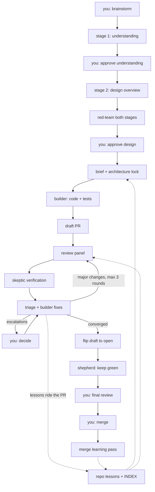

# claude-config

Personal [Claude Code](https://docs.anthropic.com/en/docs/claude-code) harness: skills, agents, rules, and settings, versioned as a git repository. It automates the software delivery pipeline end to end — from a raw idea to a merged pull request — so that human attention is spent only where human judgment is irreplaceable.

## The director model

The human directs; agents execute. You explain intent, approve the understanding and the design, decide escalations, and merge. Everything between those points — implementation, tests, pull requests, multi-reviewer code review, fix rounds, CI babysitting, rebases — is done by agents that message you exactly when it is your turn and never before.

## The workflow

### W1 — UNDERSTAND (`brainstorming`)

Turns a raw request into an approved design checkpoint through two gated stages. Stage 1 (Understanding) captures the reasoning chain — the task, who it is for, what the output enables, the request, and observable acceptance criteria. Stage 2 (Design Overview) produces the recommended architecture: two to three genuinely different options ranked only by outcome quality, with the green-field design always present and effort never a ranking criterion. An adversarial red-team attacks both stages, hunting for blind spots and for human-economics smuggled into the ranking, before you see the result. Each stage ends with your explicit approval, and the approved architecture is recorded in the checkpoint's Decisions section. Nothing proceeds to implementation without your sign-off.

### W2 — BUILD (`implement`)

The single manual entry point of an otherwise automatic chain. The main agent authors an implementation brief that carries the architecture lock: the approved design travels with the work, and the builder must escalate rather than silently deviate from it. One persistent builder agent (opus) is spawned per PR — it writes all code and tests, keeps its implementation rationale for the PR's entire life, and is the only agent that ever writes code for that PR, in the initial build and in every later fix round. Work lands as stacked, single-concern PRs, each with its own tests and a Verification section (exact command plus expected output). PRs are created as drafts via `push-pr`: draft while machines iterate, open only when humans enter.

### W3 — REVIEW (`pr-review` + `review-triage`)

The in-depth review loop runs on the draft PR. `pr-review` spawns a blind, parallel panel of reviewers; findings survive only if opus skeptic agents fail to refute them, and any finding bound for auto-fix additionally requires an executable reproducer before the fix is written. Verified findings post to the PR as inline resolvable comments plus an upserted sticky summary; `review-triage` then classifies every unresolved thread into exactly one bucket, dispatches fixes to the resumed builder, and re-triggers the panel only when major changes were applied (three rounds maximum). This is the cross-model integrity chain: opus builds, the session-model panel reviews, opus skeptics verify, the opus builder fixes — every artifact is checked by a different model than the one that produced it. When the loop converges, the PR flips from draft to open (`gh pr ready`) and you receive one of exactly two message types: (1) "ready for your final review — push back or merge", or (2) "escalated items — findings pushed back with uncertainty, your call", the latter also posted as a top-level bot-headed PR comment. After convergence only humans review; later pushes never re-spawn the panel.

### W4 — KEEP-GREEN (`pr-shepherd`)

A lightweight haiku routine owns the open PR until merge so nobody has to babysit it. It rebases behind base (force-push with lease only, on the PR's own branch only), classifies CI failures (flaky gets rerun, legitimate failures go to the resumed builder), autofixes lint, and keeps the PR description in sync with the diff. It pings you using the same two message types and never merges, closes, or spawns reviewers. On merge it cleans up the branch, worktree, and state, then hands the PR's full paper trail — panel comments, triage commits, escalations, your comments — to a session-model learning pass.

### L — LEARN (lessons layer)

Every human intervention becomes a lesson so future rounds need less of you. Lessons ride the PR that taught them: capture events during build and review write lesson files into the working tree, committed alongside the fixes, so learning stays human-gated through your mandatory final review with zero extra PRs. The merge-time learning pass distills anything missed into staging that rides the next PR. Lessons live in the target repository and are scoped by domain and path globs, so future brainstorms, builds, and reviews load only what applies to the work at hand.

## Pipeline



## Skills

| Skill | Trigger | Purpose |
|---|---|---|
| `brainstorming` | Manual (auto-suggested on ambiguous or feature-sized asks; never auto-runs) | Two gated stages — Understanding, then Design Overview — each red-teamed and user-approved, ending in a stored checkpoint spec |
| `implement` | Manual entry; the chain after it is automatic | Implementation brief with architecture lock, persistent builder per PR, stacked draft PRs, hand-off to review |
| `push-pr` | Auto inside the implement chain (draft mode); manual anywhere | Create or update a PR via a read-only subagent: template or generated body, labels, Verification section |
| `pr-review` | Auto inside the chain; manual on any PR | Blind parallel reviewer panel, skeptic verification with reproducers, one batched inline review plus sticky summary |
| `review-triage` | Auto inside the chain; manual on any PR | Thread burn-down: classify every thread into one bucket, dispatch fixes to the builder, resolve silently, escalate the rest |
| `pr-shepherd` | Auto at the draft-to-open flip; manually attachable to any PR | Maintenance loop: rebase, CI classification, lint, description sync, pings, cleanup, merge-time learning hand-off |
| `visual-evidence` | Auto in review when the repo profile says frontend; manual anywhere | Per-state screenshots and key-interaction GIFs, committed to the branch and upserted as an evidence comment |
| `receiving-code-review` | Behavioral — applies whenever review feedback is handled | Evaluation philosophy: verify before implementing, severity-calibrated push-back, no performative agreement |
| `build-design-system` | Manual | Build a complete frontend design system from an approved design exploration |
| `gh-inline-comment` | Internal, agent-facing only | Post inline PR comments outside the review flow via the gh API technique |

## Agents

| Agent | Model | Role |
|---|---|---|
| `builder` | opus | Persistent per PR: writes all code and tests, initial implementation and every fix round; escalates to the main agent when blocked or when the locked architecture would need to change |
| `skeptic` | opus | Read-only adversarial verifier: refutes review findings with codebase evidence (refute-by-default when uncertain); red-teams brainstorm specs |

## Model assignments

| Component | Model |
|---|---|
| `builder` agent | opus |
| `skeptic` agent | opus |
| `pr-shepherd` loop runner | haiku |
| CI log classification (flaky vs legit) | sonnet |
| Mechanical fixes (lint autofix, description sync) | sonnet |
| `push-pr` body author | sonnet |
| `visual-evidence` capture runner | haiku |
| Everything else (main agent, panel reviewers, triage judgment, brainstorming, learning pass) | session model |

Skills state the model when spawning agents (Agent tool `model` parameter). The split is deliberate: skeptics run on a different model than the reviewers whose findings they attack, so a hallucination shared by one model family cannot verify itself.

## Lessons and learning

Lessons live in the target repository — not in this one — at `.claude/lessons/<domain>/<slug>.md`, each with YAML frontmatter: `name`, a one-line `summary`, `domains` (list), and `globs` (path patterns). `.claude/lessons/INDEX.md` holds one line per lesson (summary plus domains) and is regenerated whenever a lesson is written; the repo's `CLAUDE.md` imports it via `@.claude/lessons/INDEX.md`, so the index enters context automatically in every session.

Retrieval scales through the index: consumers (the builder, each panel reviewer, brainstorming) read the one-line index and load the full text only of lessons whose domains and globs match the diff or task at hand. Two hundred lessons cost two hundred index lines, not two hundred files in context.

Capture is event-driven: triage records user push-backs and rejected findings (repo-specific ones as repo lessons, generalizable rulings as care-abouts and negative rules appended to the reviewer and persona files), brainstorming records platform decisions, and the shepherd's merge-time pass distills anything missed from the PR's paper trail into staging under `~/.claude/state/lessons/<owner>-<repo>/`, which the next build commits into the repo's lessons. All repository lessons reach the repo through PRs you review.

## Conventions

- **Per-repo profiles.** Skills contain zero repository-specific facts. Repo facts — `trust` (full-autonomy or read-only), `frontend`, `base_branch`, `launch_command`, `stacking`, `infrastructure`, `evidence_storage`, `spec_location` — live in the harness's per-repo project memory: one JSON file per repository at `~/.claude/profiles/<owner>-<repo>.json`, asked once when first needed (question selector) and written back. Unattended runs missing a fact use the safe default (read-only / skip) and flag it in the report.
- **Bot identity.** Every autonomously posted GitHub comment begins with the line `**Harness automated comment**`. PR descriptions and commit messages you own never mention AI or automation.
- **Autonomous fix commits** carry the git trailer `Harness-Fix: true`, so the panel never re-reviews its own fixes into a loop.
- **PR lifecycle.** Draft while machines iterate; flipped to open the moment a human-facing message fires.

## Repository layout

```
~/.claude/
├── CLAUDE.md        global rules (decision making, code quality, testing, workflow)
├── settings.json    permissions, plugins, environment
├── rules/           supplementary global rules
├── hooks/           PreToolUse guards (commit attribution)
├── agents/          builder, skeptic
├── skills/          the workflow skills listed above
└── plans/           design documents for this harness
```

An ignore-all `.gitignore` keeps Claude Code's runtime files (caches, history, telemetry) out of version control; only configuration is whitelisted.

## Setup

Clone into your Claude Code configuration directory:

```bash
git clone git@github.com:palazzem/claude-config.git ~/.claude
```

If `~/.claude` already exists, clone elsewhere and copy the pieces you want.

Prerequisites:

- [Claude Code](https://docs.anthropic.com/en/docs/claude-code) CLI installed
- [GitHub CLI](https://cli.github.com/) (`gh`) installed and authenticated — all GitHub interactions go through `gh`
- [Graphite](https://graphite.dev/) (`gt`) optional — enables PR stacking in the build workflow (`gt auth` once; per-repo enablement is recorded in the repo profile)
- [Playwright](https://playwright.dev/) — visual evidence capture runs via `npx playwright`; browsers download on first use

## License

Licensed under the Apache License 2.0. See [LICENSE](LICENSE) for details.
