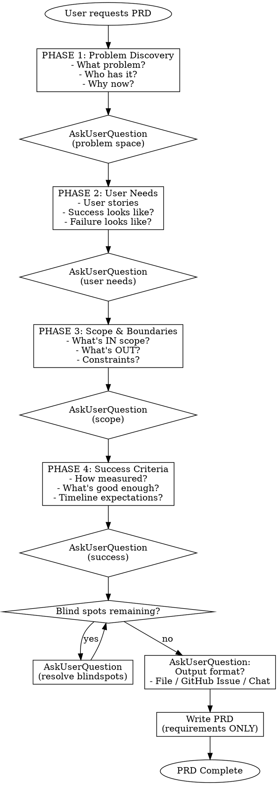

# Writing PRDs

## Overview

A PRD defines **what** a product/feature should do and **why**, never **how**. This skill enforces a multi-phase brainstorming process that eliminates blind spots before any document is written.

**Core principle:** No PRD without complete requirements discovery. Assumptions are blind spots in disguise.

## The Iron Law

```
NO PRD WITHOUT COMPLETING ALL PHASES
```

**No exceptions:**
- Not for "simple features"
- Not for "obvious requirements"
- Not for "time pressure"
- Not for "I'll fill in details later"

## Process Flow



## Phase Details

### Phase 1: Problem Discovery

**Ask about:**
- What problem does this solve?
- Who experiences this problem?
- How do they cope today?
- Why is this important now?
- What happens if we don't solve it?

**Red flag:** User jumps to solution. Redirect to problem.

### Phase 2: User Needs

**Ask about:**
- Who are the users? (roles, personas)
- What do they need to accomplish?
- What does success look like for them?
- What would make them abandon this?
- Are there different user types with different needs?

**Red flag:** Technical requirements appearing. These are implementation, not needs.

### Phase 3: Scope & Boundaries

**Ask about:**
- What is explicitly IN scope?
- What is explicitly OUT of scope?
- Are there hard constraints? (budget, timeline, compliance)
- What dependencies exist?
- What can be deferred to v2?

**Red flag:** Scope creep. If everything is in scope, nothing is defined.

### Phase 4: Success Criteria

**Ask about:**
- How will we know this succeeded?
- What metrics matter?
- What's the minimum viable outcome?
- What timeline expectations exist?
- Who decides if it's done?

**Red flag:** Vague success criteria. "Users like it" is not measurable.

## Using AskUserQuestion

**REQUIRED:** Use the AskUserQuestion tool for each phase. Do not proceed without answers.

Example usage:
```
AskUserQuestion with questions:
- header: "Problem"
  question: "What specific problem are you trying to solve?"
  options: [provide relevant choices based on context]

- header: "Users"
  question: "Who experiences this problem most acutely?"
  options: [provide relevant choices based on context]
```

**Combine related questions** (up to 4 per call) to respect user's time while ensuring coverage.

## Implementation Boundary

**NEVER include in a PRD:**
- Technology choices (React, PostgreSQL, Redis)
- Architecture decisions (microservices, monolith)
- API designs or data schemas
- Code patterns or libraries
- Technical implementation approaches

**These belong in a PRD:**
- User-facing behavior
- Business rules
- Constraints (performance, security requirements)
- Success metrics
- Acceptance criteria

| Implementation (NO) | Requirement (YES) |
|---------------------|-------------------|
| "Use WebSockets" | "Updates appear within 2 seconds" |
| "Store in PostgreSQL" | "Data must persist across sessions" |
| "Implement with OAuth" | "Users can sign in with existing Google account" |
| "Use CSS variables" | "Theme changes instantly without page reload" |
| "Cache in Redis" | "Page loads in under 200ms" |

## Blind Spot Tracking

Maintain explicit tracking of:

**Resolved:** Questions answered, decisions made
**Unresolved:** Questions still open (MUST be resolved or documented)
**Assumptions:** Things assumed true (MUST be validated or documented)

**A PRD with undocumented blind spots is incomplete.**

## Output Formats

Ask user preference before writing:

### File Output
```markdown
# PRD: [Feature Name]

## Problem Statement
[What problem, who has it, why now]

## Users
[Who are they, what do they need]

## Requirements
### Functional Requirements
[What the system must do - user-observable behavior]

### Non-Functional Requirements
[Performance, security, compliance constraints]

## Scope
### In Scope
[Explicit list]

### Out of Scope
[Explicit list]

## Success Criteria
[Measurable outcomes]

## Open Questions
[Remaining blind spots - MUST be addressed before implementation]
```

### GitHub Issue Output

Same structure as file output, but before creating the issue:

1. **Read repository labels:** Run `gh label list` to get available labels
2. **Select appropriate labels** based on:
   - Component/area labels matching the feature scope
   - Type labels (feature, enhancement, etc.)
   - Priority labels if discussed during brainstorming
   - Any project-specific labels that apply
3. **Create issue** with selected labels using `gh issue create --label`

**Do NOT hardcode label names.** Every repository has different labeling conventions.

### Chat Output
Conversational summary with all sections covered, suitable for copy-paste or further discussion.

## Rationalization Table

| Excuse | Reality |
|--------|---------|
| "User is impatient" | Rushed PRD = rework later. Phases protect everyone. |
| "Requirements are obvious" | Obvious to whom? Validate with questions. |
| "I'll make reasonable assumptions" | Assumptions are blind spots. Ask instead. |
| "Just need a quick template" | Templates without discovery are useless. |
| "User already specified implementation" | Implementation is not requirements. Dig for the WHY. |
| "This is a simple feature" | Simple features have killed projects. Follow the process. |
| "I can fill in gaps later" | Gaps become scope creep or missed requirements. |
| "User already has their PRD written" | Existing docs often have blind spots. Validate through phases. |
| "I answered similar questions before" | Each feature is different. Ask fresh questions. |

## Handling Incomplete Answers

**User answers only some questions:** Re-ask unanswered questions. Do not proceed with gaps.

**User says "I don't know":**
- If truly unknown, document as Open Question in PRD
- If user is deflecting, explain why the answer matters
- An "I don't know" that affects core requirements blocks the PRD

**User wants to combine/skip phases:** Each phase surfaces different insights. Do not combine. The 4-phase structure exists because blind spots hide in skipped conversations.

## Red Flags - STOP

If you're thinking:
- "Let me just draft something quick..."
- "I can assume this is a standard..."
- "The user seems to know what they want..."
- "This technical choice implies the requirement..."
- "I can combine these phases to save time..."
- "The user answered enough, I can infer the rest..."

**STOP.** Return to the current phase. Ask the questions.

## Quality Checklist

Before finalizing PRD:
- [ ] All four phases completed with user answers
- [ ] No implementation details in document
- [ ] Scope explicitly bounded (in AND out)
- [ ] Success criteria are measurable
- [ ] Blind spots resolved or documented in Open Questions
- [ ] Output format confirmed with user
