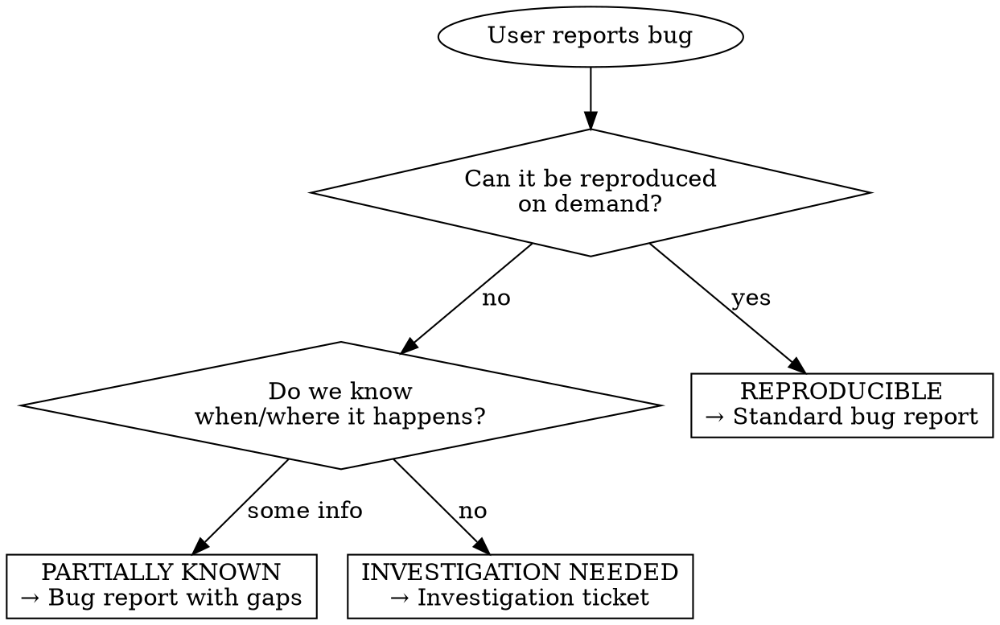
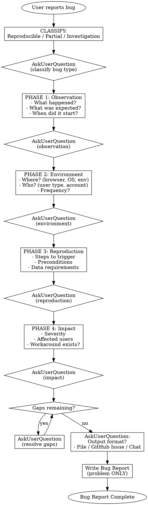

# Writing Bug Reports

## Overview

A bug report describes **what is broken** and **how to observe it**, never **how to fix it**. This skill enforces structured discovery that classifies the bug type before documentation.

**Core principle:** A bug report without reproduction clarity is a ticket to nowhere. Know what you're documenting before writing.

## The Iron Law

```
NO BUG REPORT WITHOUT CLASSIFYING THE BUG TYPE FIRST
```

**No exceptions:**
- Not for "obvious bugs"
- Not for "urgent issues"
- Not for "simple problems"
- Not for "I already know what's wrong"

## Bug Classification

**Before any discovery, classify the bug:**



| Type | Characteristics | Output |
|------|-----------------|--------|
| **Reproducible** | Clear steps, consistent behavior | Full bug report |
| **Partially Known** | Some context, intermittent or unclear trigger | Bug report with documented unknowns |
| **Investigation Needed** | Vague reports, no pattern identified | Investigation ticket (NOT a bug report) |

## Process Flow



## Phase Details

### Classification (FIRST)

**Ask:**
- Can you reproduce this consistently?
- Do you know the exact steps to trigger it?
- Is this based on user reports or direct observation?

**Outcome determines template used.**

### Phase 1: Observation

**Ask about:**
- What exactly happened? (specific behavior)
- What should have happened? (expected behavior)
- When did this start? (regression vs always broken)
- Is there an error message?

**Red flag:** User describes solution. Redirect to problem.

### Phase 2: Environment

**Ask about:**
- Where does this occur? (production, staging, local)
- Browser/OS/device if applicable
- User account type or permissions
- How often? (always, sometimes, once)

**Red flag:** "It happens sometimes" without more detail. Push for patterns.

### Phase 3: Reproduction

**Ask about:**
- Exact steps to trigger the bug
- Preconditions (logged in? specific data?)
- Minimum data/setup required
- Can you reproduce it now?

**For Investigation Needed bugs:** Document what's known, explicitly state what's unknown.

### Phase 4: Impact

**Ask about:**
- How severe? (blocking, degraded, cosmetic)
- How many users affected?
- Is there a workaround?
- Business impact?

**Severity levels:**
| Level | Description |
|-------|-------------|
| **Critical** | System down, data loss, security breach |
| **High** | Major feature broken, no workaround |
| **Medium** | Feature impaired, workaround exists |
| **Low** | Minor issue, cosmetic, edge case |

## Using AskUserQuestion

**REQUIRED:** Use AskUserQuestion for classification and each phase.

Example for classification:
```
AskUserQuestion with questions:
- header: "Bug type"
  question: "Can you reproduce this bug consistently with specific steps?"
  options:
    - "Yes, I can reproduce it every time"
    - "Sometimes, but not always"
    - "No, I only have user reports"
```

**Combine related questions** (up to 4 per call) to respect user's time.

## Implementation Boundary

**NEVER include in a bug report:**
- Proposed fixes or solutions
- Code changes needed
- Architecture recommendations
- "This could be fixed by..."

**These belong in a bug report:**
- Observed behavior
- Expected behavior
- Steps to reproduce
- Environment details
- Error messages (verbatim)
- Impact assessment

| Solution (NO) | Problem (YES) |
|---------------|---------------|
| "Add debouncing to the button" | "Button can be clicked multiple times" |
| "Fix the SQL query" | "Page takes 30 seconds to load" |
| "Update the token refresh logic" | "Users see 'invalid token' after 1 hour" |
| "The regex is wrong" | "Email validation rejects valid emails" |

## Output Templates

### Reproducible Bug Report

```markdown
# Bug: [Short descriptive title]

## Summary
[One sentence describing the problem]

## Environment
- **Platform:** [web/mobile/desktop]
- **Browser/OS:** [if applicable]
- **Environment:** [production/staging/local]
- **Account type:** [if relevant]

## Steps to Reproduce
1. [Precondition if needed]
2. [Step]
3. [Step]
4. [Observe bug]

## Expected Behavior
[What should happen]

## Actual Behavior
[What actually happens]

## Error Messages
[Verbatim error text or "None"]

## Severity
[Critical/High/Medium/Low] - [Brief justification]

## Impact
- **Users affected:** [estimate]
- **Workaround:** [Yes/No - describe if yes]

## Additional Context
[Screenshots, logs, related issues]
```

### Partially Known Bug Report

Same template, plus:

```markdown
## Known Gaps
- [ ] [What we don't know yet]
- [ ] [What needs investigation]

## Reproduction Notes
[What works, what doesn't, patterns observed]
```

### Investigation Ticket (Not a Bug Report)

```markdown
# Investigation: [Symptom description]

## Symptom
[What users are reporting]

## What We Know
- [Fact 1]
- [Fact 2]

## What We Don't Know
- [ ] [Question 1]
- [ ] [Question 2]

## Suspected Areas
- [Component/area that might be involved]

## Investigation Steps
1. [ ] [First thing to check]
2. [ ] [Second thing to check]

## Success Criteria
[How we'll know when investigation is complete - usually "can file a proper bug report"]
```

### GitHub Issue Output

Before creating:

1. **Read repository labels:** Run `gh label list`
2. **Select appropriate labels** based on:
   - Bug type (bug, investigation, triage)
   - Severity labels if available
   - Component/area labels
   - Priority labels if discussed
3. **Create issue** with `gh issue create --label`

**Do NOT hardcode label names.** Read available labels first.

## Rationalization Table

| Excuse | Reality |
|--------|---------|
| "It's obviously a bug" | Obvious to whom? Classify and document properly. |
| "User is frustrated, just file it" | Bad bug reports waste more time than they save. |
| "I know how to fix it" | Bug report documents problem, not solution. |
| "This is urgent" | Urgency doesn't skip phases. Fast is slow. |
| "It's just like the last bug" | Each bug is different. Document this one. |
| "The steps are obvious" | Write them anyway. Future you will thank you. |
| "I'll add details later" | You won't. Document now. |

## Red Flags - STOP

If you're thinking:
- "Let me just file a quick bug..."
- "The fix is obvious, I'll note it..."
- "Users are complaining, just write something..."
- "This is similar to another bug..."
- "I can fill in reproduction steps later..."

**STOP.** Return to classification. Complete the phases.

## Handling Uncertainty

**"I don't know" is valid when documented:**
- Mark as "Partially Known" or "Investigation Needed"
- Explicitly list what's unknown
- Don't guess or assume

**Unknowns that block filing:**
- No observed behavior at all
- No affected users identified
- No environment information

**Unknowns that can be documented:**
- Exact reproduction steps (for intermittent bugs)
- Root cause (that's for investigation)
- Full scope of impact

## Quality Checklist

Before finalizing:
- [ ] Bug type classified (Reproducible/Partial/Investigation)
- [ ] All four phases completed with user answers
- [ ] No implementation suggestions in document
- [ ] Severity justified with evidence
- [ ] Gaps explicitly documented (if any)
- [ ] Output format confirmed with user
